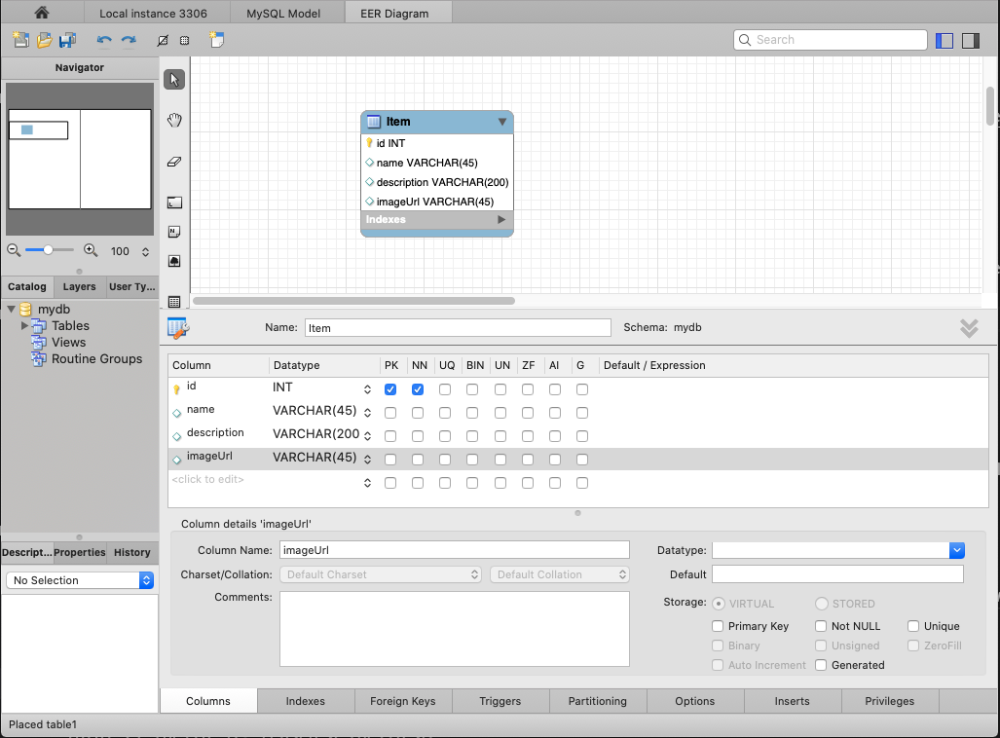

# Task 7: Implementing the Persistance Layer with MySQL

## Description

For this task, we'll be implementing the database of your application using MySQL.

## Walkthrough

### Step 1: Using MySQL Workbench to implement the database structure

> #### Useful Resources for this step
>
> - [MySQL Workbench Tutorial: complete guide to the RDBMS tool](https://www.educative.io/blog/mysql-workbench-tutorial)

In this step, we'll create a EER Model to represent the application data layer.

1. Create a new MySQL Workbench project
2. Create a new EER Model.
3. Create a new table that will represent your model(posts or products) and add the required columns:
   Eg Item:

   - `id`
   - `name`
   - `description`
   - `imageUrl`

   

4. Generate your SQL code to create your database schema. Click on File / Export / Forward Engineer SQL CREATE Script..

### Step 2: Connecting and Creating the database to your local instance of MYSQL

In this step, we'll create the database Schema on your local instance of MySQL database engine.

1.  If you haven't done it download and install the [MySQL installer](https://dev.mysql.com/downloads/installer/)
2.  Copy the SQL sentences generated on step 1.
3.  Setup the database connection to connect to your local instance of MySQL.
4.  Open the local instance connection and paste the SQL sentences and run it.

    ```sql
    -- MySQL Script generated by MySQL Workbench
    -- Sun Jan 10 14:14:47 2021
    -- Model: New Model    Version: 1.0
    -- MySQL Workbench Forward Engineering

    SET @OLD_UNIQUE_CHECKS=@@UNIQUE_CHECKS, UNIQUE_CHECKS=0;
    SET @OLD_FOREIGN_KEY_CHECKS=@@FOREIGN_KEY_CHECKS, FOREIGN_KEY_CHECKS=0;
    SET @OLD_SQL_MODE=@@SQL_MODE, SQL_MODE='ONLY_FULL_GROUP_BY,STRICT_TRANS_TABLES,NO_ZERO_IN_DATE,NO_ZERO_DATE,ERROR_FOR_DIVISION_BY_ZERO,NO_ENGINE_SUBSTITUTION';

    -- -----------------------------------------------------
    -- Schema itemsdb
    -- -----------------------------------------------------

    -- -----------------------------------------------------
    -- Schema itemsdb
    -- -----------------------------------------------------
    CREATE SCHEMA IF NOT EXISTS `itemsdb` DEFAULT CHARACTER SET utf8 ;
    USE `itemsdb` ;

    -- -----------------------------------------------------
    -- Table `mydb`.`Item`
    -- -----------------------------------------------------
    CREATE TABLE IF NOT EXISTS `itemsdb`.`Item` (
    `id` INT NOT NULL,
    `name` VARCHAR(45) NULL,
    `description` VARCHAR(200) NULL,
    `imageUrl` VARCHAR(200) NULL,
    PRIMARY KEY (`id`))
    ENGINE = InnoDB;


    SET SQL_MODE=@OLD_SQL_MODE;
    SET FOREIGN_KEY_CHECKS=@OLD_FOREIGN_KEY_CHECKS;
    SET UNIQUE_CHECKS=@OLD_UNIQUE_CHECKS;

    ```

5.  Create a new database user running the following commands at the mysql prompt:

    ```bash
    mysql> create user 'admin'@'%' identified by 'passw0rd'; -- Creates the user
    mysql> grant all on itemsdb.* to 'admin'@'%'; -- Gives all privileges to the new user on the newly created database
    ```

    > #### Test Your Code!
    >
    > Now is a good chance to test your code, head over to MySQL Workbench schemas tab, click the refresh button and verify that your table is created as expected.
    >
    > 1. Right click on the table you created and select the option: `Select Rows - Limit 1000 `to interact with the table.
    > 2. Create a new entry manually using the tool to add data in result grid view.
    > 3. Insert a new record manually into the database:
    >    ```sql
    >    INSERT INTO `itemsdb`.`Item` (`id`, `name`, `description`, `imageUrl`) VALUES ('1', 'Chips', 'Sour Cream and Onion', 'https://images-na.ssl-images-amazon.com/images/I/81EUE1oZURL._SL1500_.jpg');
    >    ```

    > ```
    > **Expected Result**
    > You should see the schema created with the tables defined on the EER Diagram
    > Take a screenshot of your schema and the EER Diagram. Name the file SchemaEER.jpg and create a folder for      
    > screenshots of the project. 
    > ```
