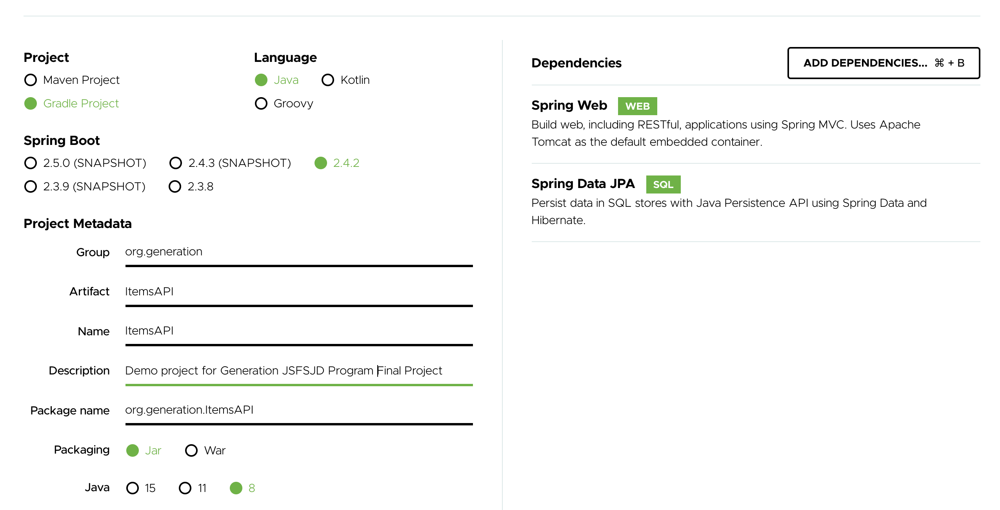

# Task 8: Database Connection with Spring Data JPA

## Description

For this task, we'll implement the backend of our web application using Spring Boot with Java.

## Walkthrough

### Step 1: Creating the base project

> #### Useful Resources for this step
>
> - [Spring Initializr](https://start.spring.io/)

In this step, we'll generate a Spring Boot project using the [spring initializr](https://start.spring.io/)

1. Go to the [spring initializr](https://start.spring.io/) and generate a new project with the following configuration:
   - Project: Gradle Project
   - Language: Java
   - Dependencies: Spring Web and Spring Data JPA (SQL)
   - Project Metadata: use meaningful names that describe your project, use Jar for packaging and select the Java version installed on your computer.
     
2. Click on Generate.
3. Create a new repo on Github for the backend and upload the generated code.

> #### Test Your Code!
>
> Now is a good chance to test your code, open your project on the Java IDE and run the main class within your Application class.
>
> **Expected Result**
> You should see the server is started correctly and no error is shown on the console.

### Step 2: Database Connection with Spring Data JPA

> #### Useful Resources for this step
>
> - [Spring Data Reference Documentation](https://docs.spring.io/spring-data/jpa/docs/current/reference/html/#jpa.introduction)
> - [Accesing data with MySQL](https://spring.io/guides/gs/accessing-data-mysql/)

In this step, we'll connect the Spring Boot project with the MySQL database created on [task 7](https://github.com/generation-org/jfsjd-final-project/tree/main/task-7).

1. Make sure you create the database user and grant access to your database:

   ```bash
       mysql> create user 'admin'@'%' identified by 'passw0rd'; -- Creates the user
       mysql> grant all on itemsdb.* to 'admin'@'%'; -- Gives all privileges to the new user on the newly created database
   ```

2. Add the following properties to the src/main/resources/application.properties:

   ```yaml
   spring.datasource.driver-class-name=com.mysql.cj.jdbc.Driver
   spring.jpa.hibernate.naming.physical-strategy=org.hibernate.boot.model.naming.PhysicalNamingStrategyStandardImpl
   spring.jpa.hibernate.ddl-auto=none
   spring.datasource.url=jdbc:mysql://${MYSQL_HOST:localhost}:3306/itemsdb
   spring.datasource.username=admin
   spring.datasource.password=passw0rd
   ```

3. Add the following dependency to your build.gradle

   ```gradle
       runtimeOnly 'mysql:mysql-connector-java'
   ```

#### Test Your Code!

> Now is a good chance to test your code, run your Application main method to start the server.
>
> **Expected Result**
> Your application should start and connect with your database, no error should be displayed on the console.

### Step 3: Interacting with the Database form your Spring Boot Project

1. Create new package called `repository.entity` and define the @Entity Model class:

   ```java
       package org.generation.ItemsAPI.repository.entity;

       import javax.persistence.Entity;
       import javax.persistence.GeneratedValue;
       import javax.persistence.GenerationType;
       import javax.persistence.Id;

       @Entity
       public class Item
       {
           @Id
           @GeneratedValue(strategy= GenerationType.AUTO)
           private Integer id;

           private String name;

           private String description;

           private String imageUrl;

           public Integer getId()
           {
               return id;
           }

           public void setId( Integer id )
           {
               this.id = id;
           }

           public String getName()
           {
               return name;
           }

           public void setName( String name )
           {
               this.name = name;
           }

           public String getDescription()
           {
               return description;
           }

           public void setDescription( String description )
           {
               this.description = description;
           }

           public String getImageUrl()
           {
               return imageUrl;
           }

           public void setImageUrl( String imageUrl )
           {
               this.imageUrl = imageUrl;
           }
       }
   ```

2. Create your repository interface to access the `Item` entity data under the repository package:

   For example:

   ```java
    package org.generation.ItemsAPI.repository;

    import org.generation.ItemsAPI.repository.entity.Item;
    import org.springframework.data.repository.CrudRepository;

    // This will be AUTO IMPLEMENTED by Spring into a Bean called itemRepository
    // CRUD refers Create, Read, Update, Delete
    public interface ItemRepository extends CrudRepository<Item, Integer>
    {
    }
   ```

3. Create a REST Controller to test your code inside a new package `controller` called ItemController:

   ```java
   @RestController
   @RequestMapping("/item")
   public class ItemController{

       final ItemRepository itemRepository;


       public ItemController(@Autowired ItemRepository itemRepository )
       {
           this.itemRepository = itemRepository;
       }

       @GetMapping
       public Iterable<Item> getItems(){
           return itemRepository.findAll();
       }
   }

   ```

> #### Test Your Code!
>
> Now is a good chance to test your code, start your application and open `http://localhost:8080/item` on your browser.
>
> **Expected Result**
> You should see the list of items stored on your MySQL database:
>
> ```json
> [
>   {
>     "id": 1,
>     "name": "Chips",
>     "description": "Sour Cream and Onion",
>     "imageUrl": "https://images-na.ssl-images-amazon.com/images/I/81EUE1oZURL._SL1500_.jpg"
>   }
> ]
> ```

## Example

Stuck? Check out the provided example in the [example/](example/) folder
